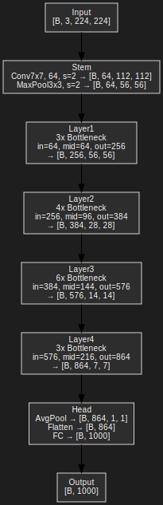

# 🔍 Neural Network Architecture Overview

This document provides a clear and concise visualization of three different deep learning architectures:

- [x] ResNet-50 (Standard and Width Multiplier 1.5)
- [x] ResNet Bottleneck Block
- [x] Fully Connected Dense Network (50 layers of 4 units each)

---

## 🧱 1. ResNet-50

ResNet-50 is a deep convolutional neural network composed of 4 stages of residual blocks built using Bottleneck units. It introduces skip connections to ease the training of very deep models.

### ✅ Standard (width multiplier = 2.0)


### ✅ Width Multiplier = 1.5
This variation increases the decrease feature width across layers reducing representational capacity.



---

## 🧩 2. ResNet Bottleneck Block

A **Bottleneck block** compresses and expands feature maps through a `1x1 → 3x3 → 1x1` structure, with an optional skip connection.

### 🧬 Structure:
- 1x1 Conv (Reduce)
- 3x3 Conv (Transform)
- 1x1 Conv (Expand)
- Optional downsample
- Residual addition
- ReLU


---

## 🔢 3. Fully Connected Dense Network

A very deep **dense network** with:
- 50 layers
- 4 units per layer
- ReLU activation
- Final linear output layer with configurable width

### 🧮 Structure:
Each layer is a fully connected block:
```
Input → Linear(4) → ReLU → Linear(4) → ... → Linear(D_out)
```

### 🖼️ Visualization:


---

## 📂 Files

| File | Description |
|------|-------------|
| `resnet50_architecture.svg` | Standard ResNet-50 diagram |
| `resnet50_architecture_width1.5.svg` | ResNet-50 with width multiplier 1.5 |
| `bottleneck_block.svg` | Visual layout of the Bottleneck block |
| `dense_network_50x4.svg` | Dense 50-layer network architecture |
