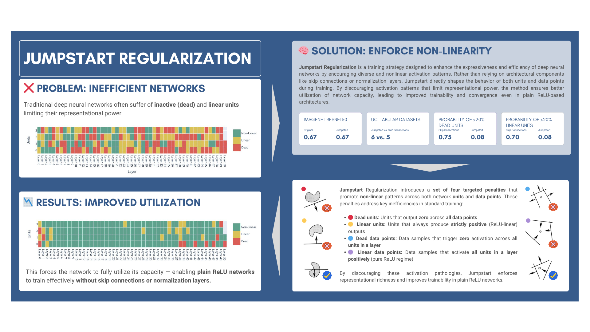

# Unit-Centric Regularization for Efficient Deep Neural Networks

This repository contains the official codebase for the article **"Unit-Centric Regularization for Efficient Deep Neural Networks"**, exploring a novel method for enforcing unit and data point utilization in deep neural networks.



## Overview

This repository provides the official implementation of **"Unit-Centric Regularization for Efficient Deep Neural Networks"**, including code to reproduce all experiments presented in the paper. Key components include:

- **Jumpstart Regularization Implementation**  
  The core method—Jumpstart Regularization—is implemented in [`jumpstart/jumpstart.py`](jumpstart/jumpstart.py), providing a principled regularization approach that enforces both unit and data point non-linear behavior.

- **Experiment Scripts**  
  Experiments can be launched using:
  - [`run_rectangular_sweep.py`](run_rectangular_sweep.py) for UCI and toy datasets using fully connected networks.
  - [`run_resnet_experiment_sweep.py`](run_resnet_experiment_sweep.py) for large-scale image classification using ResNet variants.

- **Testing Suite**  
  Comprehensive unit tests are provided in the [`test/`](test/) directory to ensure the correctness of metrics, callbacks, models, and training logic. Plotting output and visual diagnostics are also validated with static test resources.


## Pseudocode for Jumpstart Regularization Loss

This section presents pseudocode for the **Jumpstart Regularization loss**, which imposes constraints on the *preactivation values from each layer*. These preactivations—i.e., the inputs to the activation functions—are collected during a forward pass and used to define penalties that promote the presence of both strong positive and negative signals in the network.

Each preactivation tensor is assumed to have shape:

```
(batch size, number of units) plus (width, height) if applicable.
```

- For fully connected layers, the spatial dimensions may be omitted or set to 1.
- For convolutional layers, they reflect the spatial layout of the feature maps.

### Key Concepts

The method operates on each tensor and computes constraints along two structural dimensions:

- **Unit-wise**: across samples or spatial positions, for each individual neuron or channel.
- **Point-wise**: across all neurons or channels, at a specific input location or sample.

Two constraints are applied:

- **Positive constraint**: penalizes preactivations whose maximum value is less than 1, using  
  `ReLU(1 - max)`

- **Negative constraint**: penalizes preactivations whose minimum value is greater than -1, using  
  `ReLU(1 + min)`

These penalties are computed across all layers, combined, and aggregated into a final regularization term that is added to the training objective.

---

### Jumpstart Regularization Loss (Pseudocode)

```text
Function JumpstartRegularizationLoss(activations A):
    Initialize unit_losses, point_losses

    For each preactivation tensor a in A:
        For mode in [unit-wise, point-wise]:
            max_a ← ComputeMax(a, mode)
            min_a ← ComputeMin(a, mode)

            pos_loss ← ReLU(1 - max_a)
            neg_loss ← ReLU(1 + min_a)
            loss ← pos_loss + neg_loss

            If mode == unit-wise:
                unit_losses.append(loss)
            Else:
                point_losses.append(loss)

    U ← Concat(unit_losses)
    P ← Concat(point_losses)

    Return Aggregate(U, P)
```

---

### Supporting Procedures

```text
Function ComputeMax(a, mode):
    Reduce tensor a using max over all dimensions except the one corresponding to mode
    Return reduced vector of maxima
```

```text
Function ComputeMin(a, mode):
    Reduce tensor a using min over all dimensions except the one corresponding to mode
    Return reduced vector of minima
```

```text
Function Aggregate(U, P):
    Return mean(U) + mean(P)
```

---

## Repository Structure


- `data/` – Dataset loading and PyTorch Lightning datamodules  
  - `data.py` – General dataset utilities and helpers  
  - `datamodules.py` – PyTorch Lightning `DataModule` definitions  
  - `datasets.py` – Specific dataset loaders and preprocessing logic  

- `jumpstart/` – Utilities for training: callbacks, metrics, plotting, etc.  
  - `callbacks.py` – Callback for plotting unit and data point status. 
  - `jumpstart.py` – Implementation of Jumpstart Regularization.  
  - `metrics.py` – Jumpstart Regularization related metrics. 
  - `plotting.py` – Plotting functions.
  - `table.py` – Tabular generation functions.

- `model/` – Model architectures and training workflows  
  - `rectangular.py` – Rectangular (fully connected) network architecture.
  - `rectangular_experiment.py` – Experiment management class for rectangular models. 
  - `resnet_conv.py` – ResNet backbone with convolutional layers.
  - `resnet_dense.py` – ResNet variant with fully connected layers. 
  - `resnet_experiment.py` – Experiment management class for ResNet models.

- `test/` – Unit tests.

- `run_rectangular_sweep.py` – Launcher for rectangular model experiments on UCI datasets.  
- `run_resnet_experiment_sweep.py` – Launcher for Imagenet ResNet experiments.
- `README.md` – Project documentation and usage instructions  

---

## Installation

To install the required packages, run:

```bash
pip install -r requirements.txt
```

---

## Usage

### Using Jumpstart in Your Code

To apply **Jumpstart Regularization** in your own models, follow these simple steps:

### 1. Create the Regularization Object

First, initialize the `JumpstartRegularization` object with your model:

```python
from jumpstart.jumpstart import JumpstartRegularization

jumpstart = JumpstartRegularization(model)
```

### 2. Add the Regularization to Your Training Loop

To incorporate **Jumpstart Regularization**, simply use the `jumpstart` object during training. The regularization loss is automatically updated during each forward pass.

####  Standard PyTorch Training Loop

```python
for batch in dataloader:
    data, targets = batch

    # Forward pass
    outputs = model(data)

    # Compute task loss
    loss = criterion(outputs, targets)

    # Compute Jumpstart Regularization loss
    jumpstart_loss = jumpstart.loss

    # Combine with main loss
    loss += lambda_ * jumpstart_loss

    # Backward pass
    loss.backward()
    optimizer.step()
    optimizer.zero_grad()
```    

#### PyTorch Lightning Integration

If you're using PyTorch Lightning, include the regularization term inside your training_step:

```python
def training_step(self, batch, batch_idx):
    data, targets = batch
    output = self(data)
    loss = self.criterion(output, targets)

    if self.lambda_ > 0:
        loss = loss + self.lambda_ * self.jumpstart.loss

    return loss
```

You can find working examples in [`model/rectangular_experiment.py`](model/rectangular_experiment.py) and [`model/resnet_experiment.py`](model/resnet_experiment.py).

## Running Experiments

### Hardware Specifications

To ensure transparency and reproducibility, we provide below the hardware configurations used for running the experiments:

* **UCI Experiments**
  These were conducted on a shared computing cluster consisting of two machines, each equipped with **8× NVIDIA GTX 1080 Ti** GPUs.

* **ImageNet Experiments**
  These were run on a high-performance server equipped with an **NVIDIA A100 GPU**.

While the code is designed to be hardware-agnostic, performance and runtime may vary depending on the available hardware.


### UCI/Tabular Experiments

Launch experiments using rectangular networks on synthetic or tabular data. 
```bash
python run_rectangular_sweep.py \
    --depth=50 \
    --width=4 \
    --lr=0.01 \
    --batch_size=256 \
    --lambda_=0.01 \
    --use_batchnorm=False \
    --skip_connections=None \
    --dataset=moons \
    --activation=relu \
    --epochs=4000 \
    --plot_status=True \
    --gpus=auto
```
This command will run a rectangular network with the specified parameters on the `moons` dataset, using ReLU activation and logging results to WandB.

The main parameters are:
- `--depth` – Number of layers in the network.
- `--width` – Number of units in each layer.
- `--lr` – Learning rate for the optimizer.
- `--batch_size` – Size of the training batches. If None, the batch size will be set to the size of the dataset.
- `--lambda_` – Regularization strength.
- `--use_batchnorm` – Whether to use batch normalization.
- `--skip_connections` – The number of layers to skip in the skip connections. If None, no skip connections will be used.
- `--dataset` – Dataset to use (e.g., `moons`, `abalone`, `credit_approval`, ...).  [`data/data.py`](data/data.py) contains the full list of available datasets.
- `--activation` – Activation function to use (e.g., `relu`, `gelu`).
- `--epochs` – Number of training epochs.
- `--plot_status` – Whether to plot the status of units and data points during training.
- `--gpus` – Number of GPUs to use (set to `auto` to use all available GPUs). See [PyTorch Lightning GPU documentation](https://pytorch-lightning.readthedocs.io/en/stable/advanced/multi_gpu.html) for more details.

### ImageNet Experiments

Launch experiments using ResNet architectures on ImageNet. 
```bash
python run_resnet_experiment_sweep.py \
    --lambda_=0.05 \
    --depth=50 \
    --lambda_=0.00001 \
    --use_batchnorm=False \
    --use_skip_connections=False \
    --width_multiplier=2 \
    --activation=relu \
    --lr=0.1 \
    --batch_size=128 \
    --epochs=90 \
    --dataset=imagenet \
    --plot_status=True \
    --gpus=auto
```

This command will run a ResNet with the specified parameters on the `imagenet` dataset, using ReLU activation and logging results to WandB.
    
The main parameters are:
- `--lambda_` – Regularization strength.
- `--depth` – ResNet variant (e.g., `18`, `34`, `50`, `101`, `152`).
- `--use_batchnorm` – Whether to use batch normalization.
- `--use_skip_connections` – Whether to use skip connections.
- `--width_multiplier` – Width multiplier for the ResNet architecture. Default is 2.
- `--activation` – Activation function to use (e.g., `relu`, `gelu`).
- `--lr` – Learning rate for the optimizer.
- `--batch_size` – Size of the training batches. If None, the batch size will be set to the size of the dataset.
- `--epochs` – Number of training epochs.
- `--dataset` – Dataset to use (e.g., `imagenet`, `cifar10`, `mnist`). 
- `--plot_status` – Whether to plot the status of units and data points during training.
- `--gpus` – Number of GPUs to use (set to `auto` to use all available GPUs). See [PyTorch Lightning GPU documentation](https://pytorch-lightning.readthedocs.io/en/stable/advanced/multi_gpu.html) for more details.

### Testing

To run the tests, use the following command:

```bash
pytest test/
```

This will execute all tests in the `test/` directory and report the results. Tests include unit tests for the Jumpstart Regularization implementation, metrics, callbacks, and plotting functions. The tests are designed to ensure the correctness of the code and the expected behavior of the implemented features.

